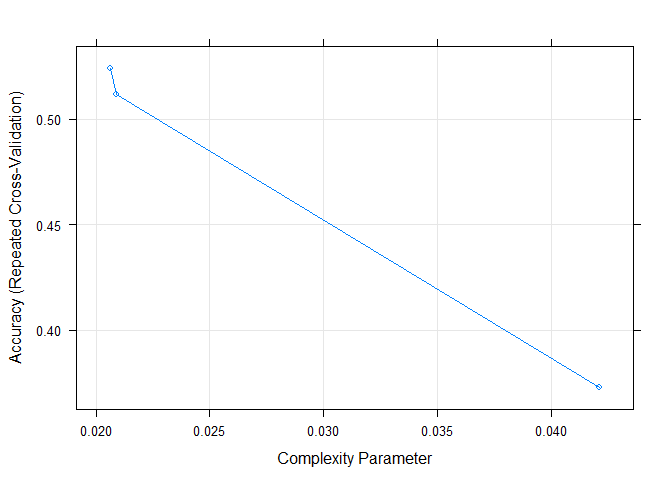
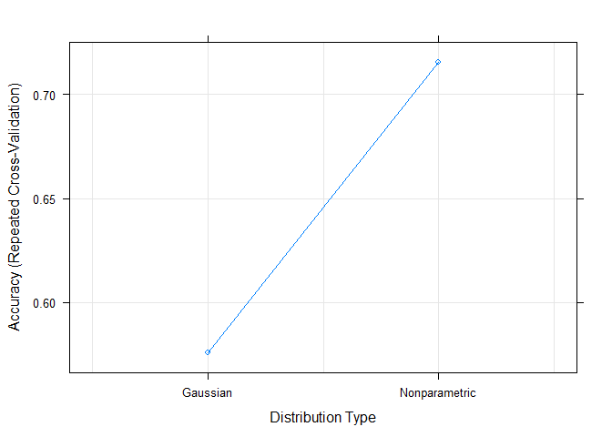
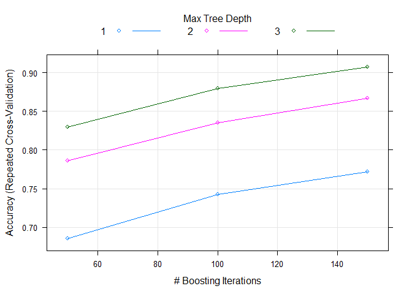
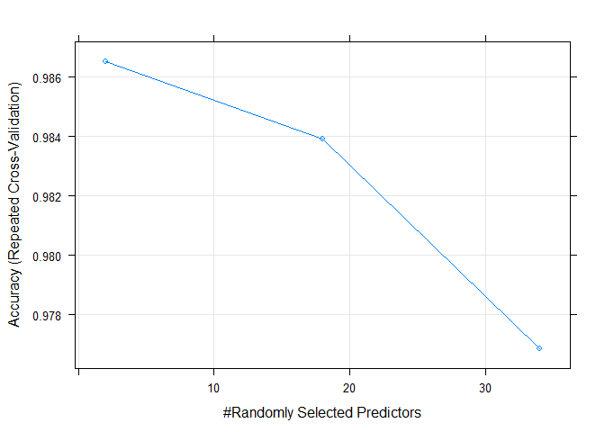
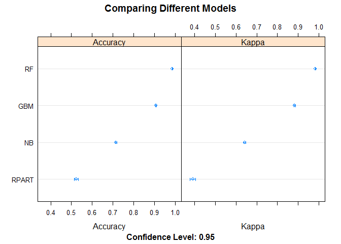

# Human Activity Recognition
Christopher Maier  
February 23, 2017  


## Synopsis

This report seeks to quantify how well a particular exercise activity has been performed, specifically how well a particular set of participants has performed the activity of lifting a barbell. 

Through the usage of activity tracking devices, vast amounts of data can be obtained in a relatively efficient manner. These devices allow for their users to track "how much" activity has been performed; however, these activities do not tend to justly see the attention of how well a given activity is performed. 

This report will track how well the participants involved within the study performed their exercises. Data was collected from accelerometers on 6 different participants. These participants exercised by performing barbell lifts in 5 different ways (correctly and 4 different ways incorrectly.

Machine learning models were evaluated; the gradient boosting method was used for analysis and the resulting predicted classes were determined using this method.

## Data Processing

Based on the source of *Human Activity Recognition* (see <http://groupware.les.inf.puc-rio.br/har>), data was obtained containing information from barbell lifts from 6 different participants. These participants were asked to perform the Unilateral Dumbbell Biceps Curl in 10 repetitions and in 5 different ways. Class A refers to performing the activity to correct specifications, while the other 4 classes used to classify the activity performance referred to lifting while making common mistakes: throwing the elbows to the front (Class B), lifting the dumbbell only halfway (Class C), lowering the dumbbell only halfway (Class D) and throwing the hips to the front (Class E). Note that to obtain this information, data was collected using accelerometers on the belt, forearm, arm, and dumbell of these activity participants.

### Reading in the Human Activity Recognition Data

A new directory was created to store the raw human activity recognition training file. This directory was then set for the proceeding analysis the raw file was downloaded from the source. The raw data file was then read in as a comma-separated value data set. 


```r
# Create directory in which to put data
directorySetup <- function(object) {
     dir.create(as.character(as.list(match.call())[2]))
}
directorySetup(HumanActivityRecognition)
setwd("~/HumanActivityRecognition")

# Download data from source
download.file("https://d396qusza40orc.cloudfront.net/predmachlearn/pml-training.csv", destfile = "pml-training.csv")

# Read the csv file from the download 
training <- read.csv("pml-training.csv")

# Remove first column (X: index) from data set
training <- training[-c(1)]
```

After reading in the data, it was shown that there are 19622 rows with 159 columns (after removing index column), as shown below. 


```r
# Show dimensions of data
dim(training)
```

```
## [1] 19622   159
```

### Subsetting the Data 

Note that not all 159 columns of data were used for the proceeding analysis. Features which had an inordinate amount of NA/blank values were excluded from the analysis due to, otherwise, a much lower volume of data. Note that these features were specific to data obtained at each given observation window (such as average, standard deviation, and variance at pitch, roll, and yaw for a given observation window). Additionally, for similar reasons, the skewness, kurtosis, max, min, and amplitude values were removed. Also, the user name, timestamp, and window features were also removed, since the analysis was not to focus on these variables. Note that 53 columns remained after this subsetting. 


```r
# Using colSums(is.na(train)), determine number of NAs in data frame
colSums(is.na(training))
```

```
##                user_name     raw_timestamp_part_1     raw_timestamp_part_2 
##                        0                        0                        0 
##           cvtd_timestamp               new_window               num_window 
##                        0                        0                        0 
##                roll_belt               pitch_belt                 yaw_belt 
##                        0                        0                        0 
##         total_accel_belt       kurtosis_roll_belt      kurtosis_picth_belt 
##                        0                        0                        0 
##        kurtosis_yaw_belt       skewness_roll_belt     skewness_roll_belt.1 
##                        0                        0                        0 
##        skewness_yaw_belt            max_roll_belt           max_picth_belt 
##                        0                    19216                    19216 
##             max_yaw_belt            min_roll_belt           min_pitch_belt 
##                        0                    19216                    19216 
##             min_yaw_belt      amplitude_roll_belt     amplitude_pitch_belt 
##                        0                    19216                    19216 
##       amplitude_yaw_belt     var_total_accel_belt            avg_roll_belt 
##                        0                    19216                    19216 
##         stddev_roll_belt            var_roll_belt           avg_pitch_belt 
##                    19216                    19216                    19216 
##        stddev_pitch_belt           var_pitch_belt             avg_yaw_belt 
##                    19216                    19216                    19216 
##          stddev_yaw_belt             var_yaw_belt             gyros_belt_x 
##                    19216                    19216                        0 
##             gyros_belt_y             gyros_belt_z             accel_belt_x 
##                        0                        0                        0 
##             accel_belt_y             accel_belt_z            magnet_belt_x 
##                        0                        0                        0 
##            magnet_belt_y            magnet_belt_z                 roll_arm 
##                        0                        0                        0 
##                pitch_arm                  yaw_arm          total_accel_arm 
##                        0                        0                        0 
##            var_accel_arm             avg_roll_arm          stddev_roll_arm 
##                    19216                    19216                    19216 
##             var_roll_arm            avg_pitch_arm         stddev_pitch_arm 
##                    19216                    19216                    19216 
##            var_pitch_arm              avg_yaw_arm           stddev_yaw_arm 
##                    19216                    19216                    19216 
##              var_yaw_arm              gyros_arm_x              gyros_arm_y 
##                    19216                        0                        0 
##              gyros_arm_z              accel_arm_x              accel_arm_y 
##                        0                        0                        0 
##              accel_arm_z             magnet_arm_x             magnet_arm_y 
##                        0                        0                        0 
##             magnet_arm_z        kurtosis_roll_arm       kurtosis_picth_arm 
##                        0                        0                        0 
##         kurtosis_yaw_arm        skewness_roll_arm       skewness_pitch_arm 
##                        0                        0                        0 
##         skewness_yaw_arm             max_roll_arm            max_picth_arm 
##                        0                    19216                    19216 
##              max_yaw_arm             min_roll_arm            min_pitch_arm 
##                    19216                    19216                    19216 
##              min_yaw_arm       amplitude_roll_arm      amplitude_pitch_arm 
##                    19216                    19216                    19216 
##        amplitude_yaw_arm            roll_dumbbell           pitch_dumbbell 
##                    19216                        0                        0 
##             yaw_dumbbell   kurtosis_roll_dumbbell  kurtosis_picth_dumbbell 
##                        0                        0                        0 
##    kurtosis_yaw_dumbbell   skewness_roll_dumbbell  skewness_pitch_dumbbell 
##                        0                        0                        0 
##    skewness_yaw_dumbbell        max_roll_dumbbell       max_picth_dumbbell 
##                        0                    19216                    19216 
##         max_yaw_dumbbell        min_roll_dumbbell       min_pitch_dumbbell 
##                        0                    19216                    19216 
##         min_yaw_dumbbell  amplitude_roll_dumbbell amplitude_pitch_dumbbell 
##                        0                    19216                    19216 
##   amplitude_yaw_dumbbell     total_accel_dumbbell       var_accel_dumbbell 
##                        0                        0                    19216 
##        avg_roll_dumbbell     stddev_roll_dumbbell        var_roll_dumbbell 
##                    19216                    19216                    19216 
##       avg_pitch_dumbbell    stddev_pitch_dumbbell       var_pitch_dumbbell 
##                    19216                    19216                    19216 
##         avg_yaw_dumbbell      stddev_yaw_dumbbell         var_yaw_dumbbell 
##                    19216                    19216                    19216 
##         gyros_dumbbell_x         gyros_dumbbell_y         gyros_dumbbell_z 
##                        0                        0                        0 
##         accel_dumbbell_x         accel_dumbbell_y         accel_dumbbell_z 
##                        0                        0                        0 
##        magnet_dumbbell_x        magnet_dumbbell_y        magnet_dumbbell_z 
##                        0                        0                        0 
##             roll_forearm            pitch_forearm              yaw_forearm 
##                        0                        0                        0 
##    kurtosis_roll_forearm   kurtosis_picth_forearm     kurtosis_yaw_forearm 
##                        0                        0                        0 
##    skewness_roll_forearm   skewness_pitch_forearm     skewness_yaw_forearm 
##                        0                        0                        0 
##         max_roll_forearm        max_picth_forearm          max_yaw_forearm 
##                    19216                    19216                        0 
##         min_roll_forearm        min_pitch_forearm          min_yaw_forearm 
##                    19216                    19216                        0 
##   amplitude_roll_forearm  amplitude_pitch_forearm    amplitude_yaw_forearm 
##                    19216                    19216                        0 
##      total_accel_forearm        var_accel_forearm         avg_roll_forearm 
##                        0                    19216                    19216 
##      stddev_roll_forearm         var_roll_forearm        avg_pitch_forearm 
##                    19216                    19216                    19216 
##     stddev_pitch_forearm        var_pitch_forearm          avg_yaw_forearm 
##                    19216                    19216                    19216 
##       stddev_yaw_forearm          var_yaw_forearm          gyros_forearm_x 
##                    19216                    19216                        0 
##          gyros_forearm_y          gyros_forearm_z          accel_forearm_x 
##                        0                        0                        0 
##          accel_forearm_y          accel_forearm_z         magnet_forearm_x 
##                        0                        0                        0 
##         magnet_forearm_y         magnet_forearm_z                   classe 
##                        0                        0                        0
```

```r
# Remove columns with NAs
training <- training[,!sapply(training, function(x) any(is.na(x)))]

# Remove columns with skewness, kurtosis variables
training <-training[, !grepl("skewness|kurtosis", colnames(training))]

# Remove columns with max, min, amplitude
training <-training[, !grepl("max|min|amplitude", colnames(training))]

# Remove user_name, raw_timestamps (parts 1 and 2), cvtd_timestamp, new_window, and num_window
furtherRemove <- c("user_name", "raw_timestamp_part_1", "raw_timestamp_part_2", "cvtd_timestamp",
                   "new_window", "num_window")
training <- training[, -which(names(training) %in% furtherRemove)]

# Show dimension after removing columns above
dim(training)
```

```
## [1] 19622    53
```

### Feature Extraction and Selection 

Next, (further) feature extraction and selection were performed. First, the data was divided into training and testing data sets, as this is standard prior to feature selection processes (i.e., testing data should not influence testing data). Note that although this data set was already deemed a training set via the source, this data was subdivided for the analysis so as to perform training, allowing for random variation. 


```r
# Use caret library for data partition
library(caret)

# Further divide training data set into training and testing
inTrain <- createDataPartition(y=training$classe, p=0.70, list=FALSE)
training <- training[inTrain,]
testing <- training[-inTrain,]

# Dimensions of training and testing data
dim(training)
```

```
## [1] 13737    53
```

```r
dim(testing)
```

```
## [1] 4119   53
```

The near-zero variance technique was used to further remove features which may as such be covariates with zero (or near-zero) variance. This further brought the number of features for analysis to 51. 


```r
# Now use NSV to determine if any more variables may be removed from model by potentially removing zero covariates
set.seed(1)
nsv <- nearZeroVar(training, saveMetrics = TRUE)
training <- training[, -nearZeroVar(nsv)] 
testing <- testing[, -nearZeroVar(nsv)]

# New dimensions of training (and testing) data
dim(training)
```

```
## [1] 13737    51
```

```r
dim(testing)
```

```
## [1] 4119   51
```

Next, a correlation matrix approach was used for further feature selection. As such, features which had a high correlation (75% was used in this analysis) were removed. Only 32 features remained.


```r
# Now use correlation for further feature selection; remove features > 75% correlated
corTrain <- cor(training[,-51])
set.seed(1)
corRemove <- findCorrelation(corTrain, 0.75)
training <- training[, -corRemove]
testing <- testing[, -corRemove]

# New dimensions of training (and testing) data
dim(training)
```

```
## [1] 13737    35
```

```r
dim(testing)
```

```
## [1] 4119   35
```

 
## Results

### Training Models 

Since the number of features had been decreased to only those determined necessary for analysis through data volume as well as near-zero variance, correlation, the focus was then on training the data to determine the accuracy of the model. Note that the response variable for the analysis was the class of exercise (variable "classe"). For this, the "Accuracy"" measure per the *caret* package was used to determine accuracy of the model.

To determine the proper classes for the testing data per the Human Activity Recognition data source, classification techniques were chosen to train the data. Specifically, the techniques for recursive partitioning, Naive Bayes, gradient boosting, and random forest methods were chosen for analysis being classification algorithms. Note that due to the computational power needed to run these algorithms, parallel processing was performed. See **Charts 1 - 4** for graphical representation of these results.


```r
# Run parallel processing for modeling
library(parallel)
library(doParallel)

# Run parallel processing for recursive partitioning
cluster <- makeCluster(detectCores() - 1)
registerDoParallel(cluster)

# Run recursive partitioning technique
set.seed(1)
control <- trainControl(method = "repeatedcv", number = 10, repeats = 3, allowParallel = TRUE)
trainRPART <- train(classe ~., method = "rpart", data = training, trControl = control)

# De-registering of parallel processing cluster
stopCluster(cluster)
registerDoSEQ()


# Run parallel processing for Naive Bayes modeling
cluster <- makeCluster(detectCores() - 1)
registerDoParallel(cluster)

# Run Naive Bayes technique
set.seed(1)
control <- trainControl(method = "repeatedcv", number = 10, repeats = 3, allowParallel = TRUE)
trainNB <- train(classe ~., method = "nb", data = training, trControl = control)

# De-registering of parallel processing cluster
stopCluster(cluster)
registerDoSEQ()

# Run parallel processing for gradient boosting modeling
cluster <- makeCluster(detectCores() - 1)
registerDoParallel(cluster)

# Run gradient boosting technique
set.seed(1)
control <- trainControl(method = "repeatedcv", number = 10, repeats = 3, allowParallel = TRUE)
trainGBM <- train(classe ~., method = "gbm", data = training, trControl = control)
```

```
## Iter   TrainDeviance   ValidDeviance   StepSize   Improve
##      1        1.6094             nan     0.1000    0.1858
##      2        1.4938             nan     0.1000    0.1299
##      3        1.4120             nan     0.1000    0.1164
##      4        1.3422             nan     0.1000    0.0955
##      5        1.2838             nan     0.1000    0.0776
##      6        1.2353             nan     0.1000    0.0645
##      7        1.1951             nan     0.1000    0.0513
##      8        1.1624             nan     0.1000    0.0627
##      9        1.1247             nan     0.1000    0.0380
##     10        1.0988             nan     0.1000    0.0461
##     20        0.8935             nan     0.1000    0.0218
##     40        0.6861             nan     0.1000    0.0093
##     60        0.5665             nan     0.1000    0.0074
##     80        0.4860             nan     0.1000    0.0063
##    100        0.4206             nan     0.1000    0.0044
##    120        0.3701             nan     0.1000    0.0019
##    140        0.3312             nan     0.1000    0.0028
##    150        0.3125             nan     0.1000    0.0016
```

```r
# De-registering of parallel processing cluster
stopCluster(cluster)
registerDoSEQ()

# Run parallel processing for random forest modeling
cluster <- makeCluster(detectCores() - 1)
registerDoParallel(cluster)

# Run random forest technique
set.seed(1)
control <- trainControl(method = "repeatedcv", number = 10, repeats = 3, allowParallel = TRUE)
trainRF <- train(classe ~., method = "rf", data = training, trControl = control)

# De-registering of parallel processing cluster
stopCluster(cluster)
registerDoSEQ()
```

**Figure 1: Recursive Partitioning Model**

```r
plot(trainRPART)
```

<!-- -->
 
**Figure 2: Naive Bayes Model**

```r
plot(trainNB)
```

<!-- -->
 
**Figure 3: Gradient Boosting Model**

```r
plot(trainGBM)
```

<!-- -->

**Figure 4: Random Forest Model**

```r
plot(trainRF)
```

<!-- -->
 

### Comparing the Models
Since we ran four models for this analysis, we can compare the four models against each other to determine which has the highest accuracy. As previously mentioned, the Accuracy value was chosen as the metric to determine accuracy. As shown in **Figure 5**, we see that, in terms of accuracy, the random forest model was determined to be more accurate. Therefore, the random forest model was selected for prediction. 


```r
# load the mlbench library
library(mlbench)

# collect resamples from models
comparisons <- resamples(list(RPART = trainRPART, NB = trainNB, GBM = trainGBM, RF = trainRF))
```

**Figure 5: Comparing Recursive Partitioning, Naive Bayes, Gradient Boosting, and Random Forest Models**

```r
dotplot(comparisons, main = "Comparing Different Models")
```

<!-- -->

### Predicting the Testing Data from the Model
Thus, since the random forest model was chosen for prediction, the random forest model was used to predict the class for the testing data set given by the Human Activity Recognition source. See the table below for prediction results. 


```r
# Determine the predicted values for the analysis, based on the chosen model
prediction <- predict(trainRF, testing)

# Table of predicted results
table(prediction)
```

```
## prediction
##    A    B    C    D    E 
## 1148  810  724  688  749
```

### Predicting the Testing Data Per Data Source
Now that we have assessed the accuracy of the model chosen, lastly, the model will be used on the testing data per <http://groupware.les.inf.puc-rio.br/har>. Note that first, the data was prepared the same way as the earlier training and testing data sets used in the analysis.  


```r
# Create directory in which to put data
directorySetup <- function(object) {
     dir.create(as.character(as.list(match.call())[2]))
}
directorySetup(HumanActivityRecognition)
setwd("~/HumanActivityRecognition")

# Download data from source
download.file("https://d396qusza40orc.cloudfront.net/predmachlearn/pml-testing.csv", destfile = "pml-testing.csv")

# Read the csv file from the download 
testing <- read.csv("pml-testing.csv")

# Remove first column (X: index) from data set
testing <- testing[-c(1)]

# Remove columns with NAs
testing <- testing[,!sapply(testing, function(x) any(is.na(x)))]

# Remove columns with skewness, kurtosis variables
testing <-testing[, !grepl("skewness|kurtosis", colnames(testing))]

# Remove columns with max, min, amplitude
testing <-testing[, !grepl("max|min|amplitude", colnames(testing))]

# Remove user_name, raw_timestamps (parts 1 and 2), cvtd_timestamp, new_window, and num_window
furtherRemove <- c("user_name", "raw_timestamp_part_1", "raw_timestamp_part_2", "cvtd_timestamp",
                   "new_window", "num_window")
testing <- testing[, -which(names(testing) %in% furtherRemove)]

# Show dimension after removing columns above
dim(testing)
```

```
## [1] 20 53
```

```r
# Remove additional columns to match training data set through NSV and correlation
testing <- testing[-nearZeroVar(nsv)]
testing <- testing[,-corRemove]
```

Next, the remaining features were used for prediction. See the below for the prediction results.

```r
# Determine the predicted values for the analysis, based on the chosen model
prediction <- predict(trainRF, testing)
print(prediction)
```

```
##  [1] B A B A A E D B A A B C B A E E A B B B
## Levels: A B C D E
```

```r
# Table of predicted results
table(prediction)
```

```
## prediction
## A B C D E 
## 7 8 1 1 3
```
